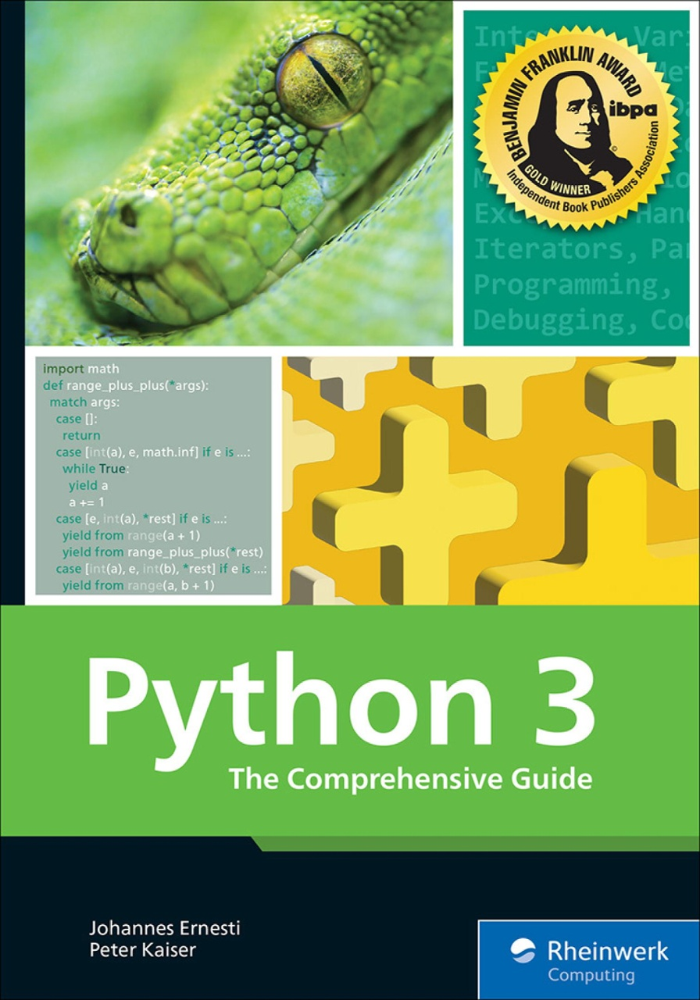

# Python 3: The Comprehensive Guide

## Overview
My review of the topics and scripts covered in the book "Python 3: The Comprehensive Guide"
by Johannes Ernesti and Peter Kaiser

## Chapters
Scripts or concepts covered in each chapter

## Book information
Name: Python 3: The Comprehensive Guide  
Author: Johannes Ernesti, Peter Kaiser  
Publisher: Rheinwerk Computing  
ISBN: 978-1493223022  
Cover:  

